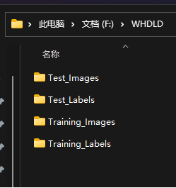

# QuuDet     

1.Support building the full range of YOLO algorithm models

2.YOLO components can be freely split and combined to facilitate the construction of new custom models


## Environment Configuration


``` shell
pip install -r requirements.txt 
```

 

## Network Configuration
 
### Component Configuration
* Component configuration files are located in the folder cfg/component, and components are divided into three categories: backbone, neck, and head.
* The layer numbering for each component starts from 0.
* The parameter out_layer specifies the default number of layers output by the component, and the parameter activate_function specifies the default activation function for the component.
* In each layer, the first parameter represents the source layer for the data, e.g., -1 represents the previous layer, -2 represents the layer before the previous layer, and so on.
* The second parameter represents the number of repetitions for the module.
* The third parameter is the module name, with definition and implementation found in models/common.py.
* The fourth parameter is the module's input, and the model will automatically calculate the input channel number during runtime. If the first input parameter of the module is the input channel number, it can be omitted in the configuration file.

 
In the backbone component, the model is built layer by layer. Taking the backbone component of yolov7-tiny as an example, 
the default activation function is nn.LeakyReLU(0.1).
The output of layer 0 becomes the input of layer 1, 
the output of layer 1 becomes the input of layers 2 and 3, 
and the Concat module at layer 6 concatenates the four layers before it, i.e., layers 2 to 5. Finally, 
the computation results are output at layers 14, 21, and 28.

```
# yolov7-tiny-backbone
out_layer: [14,21,28]
activate_funtion: nn.LeakyReLU(0.1)
backbone:
  # [from, number, module, args] c2, k=1, s=1, p=None, g=1, act=True
  [[-1, 1, Conv, [32, 3, 2]],  # 0-P1/2
   [-1, 1, Conv, [64, 3, 2]],  # 1-P2/4
   [-1, 1, Conv, [32, 1, 1]],  # 2
   [-2, 1, Conv, [32, 1, 1]],  # 3
   [-1, 1, Conv, [32, 3, 1]],  # 4
   [-1, 1, Conv, [32, 3, 1]],  # 5
   [[-1, -2, -3, -4], 1, Concat, [1]],  # 6
   [-1, 1, Conv, [64, 1, 1]],  # 7
     ……
  ]
```

In the neck component, the "in" parameter is used to specify where the model receives its input.
The specific values are obtained by reversing the output from the backbone. 
Taking yolov7-tiny-neck as an example, the "in" value at the 0th layer indicates that it receives the output of the last layer (28) of the backbone, and the "in" value at the 11th layer indicates that it receives the output of the 2nd layer (21) of the backbone.

``` 
# yolov7-tiny-neck
out_layer: [29,38,47]
activate_funtion: nn.LeakyReLU(0.1)
neck:
  [[in, 1, Conv, [256, 1, 1]],
   [-2, 1, Conv, [256, 1, 1]],
   [-1, 1, SP, [5]],
   [-2, 1, SP, [9]],
   [-3, 1, SP, [13]],
   [[-1, -2, -3, -4], 1, Concat, [1]],
   [-1, 1, Conv, [256, 1, 1]],
   [[-1, -7], 1, Concat, [1]],
   [-1, 1, Conv, [256, 1, 1]],  # 8
   [-1, 1, Conv, [128, 1, 1]],
   [-1, 1, nn.Upsample, [None, 2, 'nearest']],
   [in, 1, Conv, [128, 1, 1]], #11 route backbone P4
   [[-1, -2], 1, Concat, [1]],
      ……
  ]
```
In the head component, only one layer needs to be configured. During runtime, 
it will automatically connect based on the "out_layer" of the neck component. 
The parameter "anchors" is set to the default anchors generated from the COCO dataset. 
If these anchors do not match the current dataset, the program will automatically calculate new anchors. 
Taking the yolov7-head component as an example,"IDetect" represents the type of detection head, with its implementation defined in "models/yolo.py". 
The "nc" parameter in the module input represents the number of detection classes in the dataset, 
and will be automatically replaced with current actual number during runtime.

``` 
# yolov7-head
anchors:
  - [10,13, 16,30, 33,23]  # P3/8
  - [30,61, 62,45, 59,119]  # P4/16
  - [116,90, 156,198, 373,326]  # P5/32

head:
  [
    [[in], 1, IDetect, [nc, anchors]]
  ]
```

### Model Configuration
 
* The model configuration involves combining the components from cfg/component to form the network. PLease refer to the existing configurations in cfg/model for guidance.
* Parameters "out_layer" and "activate_function" can also be configured for the backbone and neck components, and parameters "anchors" can also be configured in the head component. The specified values herein prevail other definitions.
* The "loss_function" parameter can be configured to specify the method for calculating the loss:
* * For anchor-based detection heads, it can be set to either "anchor-loss" or "SimOTA-anchor-loss".
* * For anchor-free detection heads, it can be set to "TalOTA-anchor-free-loss".

Taking the yolov7-tiny model as an example, the yolov7-tiny-backbone, yolov7-tiny-neck, and yolov7-head components can be replaced with the available components to create a new model.
``` 
# yolov7-tiny
model:
  backbone:
    name: yolov7-tiny-backbone
    out_layer: [ 29,38,47 ]
    activate_funtion: nn.LeakyReLU(0.1)
  neck:
    name: yolov7-tiny-neck
    out_layer: [ 29,38,47 ]
    activate_funtion: nn.LeakyReLU(0.1)
  head:
    name: yolov7-head
    anchors:
      - [ 19,27,  44,40,  38,94 ]  # P3/8
      - [ 96,68,  86,152,  180,137 ]  # P4/16
      - [ 140,301,  303,264,  238,542 ]  # P5/32

loss_funtion: SimOTA-anchor-loss

```
 # target detection
## Training

### Data Preparation

* The dataset uses txt files in the YOLO format as labels, where the label content consists of:
* Class index, normalized coordinates of the detection box center (x, y), and the width and height of the detection box.
```  
1 0.683 0.611 0.586 0.244
 ```

* The training and validation images are divied based on the image paths provided in train.txt and val.txt.
* The image folder can be named 'images' or 'JPEGImages'.
* The label folder should be named 'labels'.
* Ensure that the filenames of images and labels match, and the label folder path is based on the corresponding image folder path with 'images' or 'JPEGImages' replaced by 'labels'. For example:
```  
If the image path in train.txt is 
"/home/work/voc/images/train/2007_000005.jpg", 
then the label path should be 
"/home/work/voc/labels/train/2007_000005.txt".
 ```
### Data Configuration

* The data configuration can be set according to data/voc.yaml.
* The parameters train and val specify the paths to train.txt and val.txt, respectively.
* The parameter nc is the number of detection classes.
* The parameter names is a list of detection class names.

``` 
# voc.yaml
train: voc/train.txt
val: voc/val.txt 
nc: 20   
names: ['aeroplane', 'bicycle', 'bird', 'boat', 'bottle', 'bus', 'car', 'cat', 'chair', 'cow', 'diningtable', 'dog',
        'horse', 'motorbike', 'person', 'pottedplant', 'sheep', 'sofa', 'train', 'tvmonitor']
```

### Training Configuration

* In the main function of train.py, default parameters can be configured. 
* --weights is the path to the pre-trained model, which can be left empty.
* --cfg specifies the path to the network model configuration file, can add scale ,such as use 'yolov8n.yaml' will call yolov8.yaml with scale 'n'.
* --data specifies the path to the data configuration file.
* --epoch indicates the number of training epochs.
* --batch-size specifies the number of images per batch during training and should be adjusted based on available GPU memory.
* --conf-thres is the confidence threshold, which filters detection boxes with a confidence score lower than this value.
* --iou-thres is the NMS threshold for iou. When the iou of two detection frames is greater than this value, it is considered to be the same object and the detection frame with higher confidence is retained by the NMS.
* If you want to resume the previously interrupted training, you can directly add a parameter "--resume".
* If you load a trained model and want to start training from epoch 0, you can add a parameter --clear.
* You can add a parameter --warm-restart to enable the warm restart training strategy, which divides the training into 4 stages according to the epoch and reduces the data augmentation methods in each stage.

``` shell
# Run training command with optional parameters
python train.py  --batch-size 8 --data data/voc.yaml  --cfg cfg/custom/yolov7-tiny.yaml
```
* Training results will be saved in the folder runs/train/exp*/, containing generated models and recorded values during training.
 
## Testing
### Testing Configuration
* In the main function of test.py, default parameters can be configured. 
* --weights is the path to the model, which must be specified.
* --data specifies the path to the data configuration file.
* --conf-thres is the confidence threshold, which filters detection boxes with a confidence score lower than this value.
* --iou-thres is the NMS threshold for iou. When the iou of two detection frames is greater than this value, it is considered to be the same object and the detection frame with higher confidence is retained by the NMS.

``` shell
# Run testing command with optional parameters
python test.py  --weights runs/train/exp1/weights/best.pt --data data/voc.yaml 
```
* Test results will be displayed in the console, including metrics such as precision, recall, and average precision (mAP).
* Test results are also saved in the folder runs/test/exp*/.
 ## Detection
### Detection Configuration
* In the main function of detect.py, default parameters can be configured. 
* --weights is the path to the model, which must be specified.
* --source specifies the path to the folder containing images to be detected.
* --conf-thres is the confidence threshold, which filters detection boxes with a confidence score lower than this value.
* --iou-thres is the NMS threshold for iou. When the iou of two detection frames is greater than this value, it is considered to be the same object and the detection frame with higher confidence is retained by the NMS.

``` shell
# Run inference command with optional parameters
python detect.py  --weights runs/train/exp1/weights/best.pt --source inference/images 
```
* Inference results will be saved in the folder runs/detect/exp*/.
 ## Export ONNX Model
### Export Configuration
* In the main function of export.py, default parameters can be configured. 
* --weights is the path to the model, which must be specified.
``` shell
# Run export command with optional parameters
python export.py  --weights runs/train/exp1/weights/best.pt   
```
* The export results will be saved in the same directory level as the model path.

 ## Testing ONNX models
* Support testing ONNX models exported by both our framework and Darknet.

### Testing ONNX configuration
* --weights is the path to the model, which cannot be empty.
* --data is the path to the model's data, which cannot be empty.
* --darknet indicates a Darknet model.
``` shell
# You can run the export command with parameters
python test_onnx.py --weights runs/train/exp1/weights/best.onnx --data data/voc.yaml
``` 
* The exported results will be saved in the directory under runs/test_onnx/exp*/.


# Image Segmentation

## Training

### Data Preparation
* The dataset can be created by using Labelme for annotation or by downloading datasets from the internet.
* After annotation with Labelme, a JSON file is generated, which can be converted to label images using the tool/seg_json2png.py script.
* 
* As shown in the image, the dataset folder contains four subfolders: Test_Images, Test_Labels, Training_Images, and Training_Labels, which correspond to test images, test labels, training images, and training labels, respectively.
* Images are in JPG format, and label files are in PNG format with 8-bit depth.

### Data Configuration

* Data configuration can be set in the water.yaml file, specifying the dataset path, for example: data_path: /home/work/data/citywaterCopy
``` 
# water.yaml
data_path: /home/work/data/citywaterCopy
nc: 2  # number of classes
names: ["background", "water"]
```

### Training Configuration

* --weights is the path to the pre-trained model, which can be left empty.
* --cfg is the path to the network model configuration file, for example: "cfg/model/unet-yk.yaml".
* --data is the path to the data configuration file, which cannot be empty, for example: "data/water.yaml".
* --epoch is the number of training epochs.
* --batch-size is the number of images per batch during training, which should be set according to the available GPU memory.

``` shell
# Run the training command with optional arguments
python train_seg.py --cfg cfg/model/unet-yk-sdp.yaml --data data/water.yaml --batch-size 2
```

* The training results will be saved in the runs/train_seg/exp*/ directory, which includes the generated models and recorded metrics during training.

## Testing
### Testing Configuration
* --weights is the path to the model, which cannot be empty.
* --cfg is the path to the network model configuration file, for example: "cfg/model/unet-yk.yaml".
* --data is the path to the data configuration file, which cannot be empty.
``` shell
# Run the training command with optional arguments
python test_seg.py --weights runs/train_seg/exp/weights/best.pt --cfg cfg/model/unet-yk-sdp.yaml --data data/water.yaml 
```
* After testing, the results will be displayed in the console, including metrics such as precision, recall, and mean average precision (mAP).
* The testing results will be saved in the runs/test_seg/exp*/ directory.

## Detection
### Detection Configuration
* --weights is the path to the model, which cannot be empty.
* --cfg is the path to the network model configuration file, for example: "cfg/model/unet-yk.yaml".
* --source is the path to the images to be detected.
``` shell
# Run the training command with optional arguments
python detect_seg.py  --weights runs/train_seg/exp/weights/best.pt --cfg cfg/model/unet-yk-sdp.yaml --source inference/images 
```
* The detection results will be saved in the runs/detect_seg/exp*/ directory.


## Reference Projects
<details><summary> <b>Expand</b> </summary>

* [https://github.com/AlexeyAB/darknet](https://github.com/AlexeyAB/darknet)
* [https://github.com/WongKinYiu/yolov7](https://github.com/WongKinYiu/yolov7)
* [https://github.com/yjh0410/PyTorch_YOLOv1](https://github.com/yjh0410/PyTorch_YOLOv1)
* [https://github.com/longcw/yolo2-pytorch](https://github.com/longcw/yolo2-pytorch)
* [https://github.com/ultralytics/yolov3](https://github.com/ultralytics/yolov3) 
* [https://github.com/WongKinYiu/PyTorch_YOLOv4](https://github.com/WongKinYiu/PyTorch_YOLOv4)
* [https://github.com/WongKinYiu/ScaledYOLOv4](https://github.com/WongKinYiu/ScaledYOLOv4)
* [https://github.com/Megvii-BaseDetection/YOLOX](https://github.com/Megvii-BaseDetection/YOLOX)
* [https://github.com/WongKinYiu/yolor](https://github.com/WongKinYiu/yolor)
* [https://github.com/ultralytics/yolov5](https://github.com/ultralytics/yolov5)
* [https://github.com/meituan/YOLOv6](https://github.com/meituan/YOLOv6)
* [https://github.com/ultralytics/yolov8](https://github.com/ultralytics/yolov8)
* [https://github.com/AlanLi1997/Slim-neck-by-GSConv](https://github.com/AlanLi1997/Slim-neck-by-GSConv)
</details>

## Reference Papers
<details><summary> <b>Expand</b> </summary>

* [[1] Redmon, Joseph, Santosh Divvala, Ross Girshick, and Ali Farhadi. "You only look once: Unified, real-time object detection." In Proceedings of the IEEE conference on computer vision and pattern recognition, pp. 779-788. 2016.  ](https://www.cv-foundation.org/openaccess/content_cvpr_2016/html/Redmon_You_Only_Look_CVPR_2016_paper.html)
* [[2] Redmon, Joseph, and Ali Farhadi. "YOLO9000: better, faster, stronger." In Proceedings of the IEEE conference on computer vision and pattern recognition, pp. 7263-7271. 2017.](https://openaccess.thecvf.com/content_cvpr_2017/html/Redmon_YOLO9000_Better_Faster_CVPR_2017_paper.html)
* [[3] Redmon, Joseph, and Ali Farhadi. "Yolov3: An incremental improvement." arXiv preprint arXiv:1804.02767 (2018).](https://arxiv.org/abs/1804.02767)
* [[4] Bochkovskiy, Alexey, Chien-Yao Wang, and Hong-Yuan Mark Liao. "Yolov4: Optimal speed and accuracy of object detection." arXiv preprint arXiv:2004.10934 (2020).](https://arxiv.org/abs/2004.10934)
* [[5] Li, Chuyi, Lulu Li, Hongliang Jiang, Kaiheng Weng, Yifei Geng, Liang Li, Zaidan Ke et al. "YOLOv6: A single-stage object detection framework for industrial applications." arXiv preprint arXiv:2209.02976 (2022).](https://arxiv.org/abs/2209.02976)
* [[6] Wang, Chien-Yao, Alexey Bochkovskiy, and Hong-Yuan Mark Liao. "YOLOv7: Trainable bag-of-freebies sets new state-of-the-art for real-time object detectors." In Proceedings of the IEEE/CVF Conference on Computer Vision and Pattern Recognition, pp. 7464-7475. 2023.](https://openaccess.thecvf.com/content/CVPR2023/html/Wang_YOLOv7_Trainable_Bag-of-Freebies_Sets_New_State-of-the-Art_for_Real-Time_Object_Detectors_CVPR_2023_paper.html)
* [[7] Terven, Juan, and Diana Cordova-Esparza. "A comprehensive review of YOLO: From YOLOv1 to YOLOv8 and beyond." arXiv preprint arXiv:2304.00501 (2023).](https://arxiv.org/abs/2304.00501) 
* [[8] Tu, Peng, Xu Xie, Ming Ling, Min Yang, Guo AI, Yawen Huang, and Yefeng Zheng. "FemtoDet: An Object Detection Baseline for Energy Versus Performance Tradeoffs." arXiv preprint arXiv:2301.06719 (2023).](https://arxiv.org/abs/2301.06719)
* [[9] Ganesh, Prakhar, Yao Chen, Yin Yang, Deming Chen, and Marianne Winslett. "YOLO-ReT: Towards high accuracy real-time object detection on edge GPUs." In Proceedings of the IEEE/CVF Winter Conference on Applications of Computer Vision, pp. 3267-3277. 2022.](https://arxiv.org/abs/2110.13713)
* [[10] Li, Hulin, Jun Li, Hanbing Wei, Zheng Liu, Zhenfei Zhan, and Qiliang Ren. "Slim-neck by GSConv: A better design paradigm of detector architectures for autonomous vehicles." arXiv preprint arXiv:2206.02424 (2022).](https://arxiv.org/abs/2206.02424)
* [[11] Ding, Xiaohan, Xiangyu Zhang, Ningning Ma, Jungong Han, Guiguang Ding, and Jian Sun. "Repvgg: Making vgg-style convnets great again." In Proceedings of the IEEE/CVF conference on computer vision and pattern recognition, pp. 13733-13742. 2021.](https://arxiv.org/abs/2101.03697) 
* [[12] Ghiasi, Golnaz, Yin Cui, Aravind Srinivas, Rui Qian, Tsung-Yi Lin, Ekin D. Cubuk, Quoc V. Le, and Barret Zoph. "Simple copy-paste is a strong data augmentation method for instance segmentation." In Proceedings of the IEEE/CVF conference on computer vision and pattern recognition, pp. 2918-2928. 2021.](https://arxiv.org/abs/2012.07177)
* [[13] Dosovitskiy, Alexey, Lucas Beyer, Alexander Kolesnikov, Dirk Weissenborn, Xiaohua Zhai, Thomas Unterthiner, Mostafa Dehghani et al. "An image is worth 16x16 words: Transformers for image recognition at scale." arXiv preprint arXiv:2010.11929 (2020).](https://arxiv.org/abs/2010.11929) 
* [[14] Tan, Mingxing, Ruoming Pang, and Quoc V. Le. "Efficientdet: Scalable and efficient object detection." In Proceedings of the IEEE/CVF conference on computer vision and pattern recognition, pp. 10781-10790. 2020.](https://arxiv.org/abs/1911.09070) 
* [[15] Zheng, Zhaohui, Ping Wang, Wei Liu, Jinze Li, Rongguang Ye, and Dongwei Ren. "Distance-IoU loss: Faster and better learning for bounding box regression." In Proceedings of the AAAI conference on artificial intelligence, vol. 34, no. 07, pp. 12993-13000. 2020.](https://arxiv.org/abs/1911.08287v1) 
* [[16] Li, Xiang, Wenhai Wang, Lijun Wu, Shuo Chen, Xiaolin Hu, Jun Li, Jinhui Tang, and Jian Yang. "Generalized focal loss: Learning qualified and distributed bounding boxes for dense object detection." Advances in Neural Information Processing Systems 33 (2020): 21002-21012.](https://arxiv.org/abs/2006.04388)
* [[17] Zhang, Zhi, Tong He, Hang Zhang, Zhongyue Zhang, Junyuan Xie, and Mu Li. "Bag of freebies for training object detection neural networks." arXiv preprint arXiv:1902.04103 (2019).](https://arxiv.org/abs/1902.04103) 
* [[18] Rezatofighi, Hamid, Nathan Tsoi, JunYoung Gwak, Amir Sadeghian, Ian Reid, and Silvio Savarese. "Generalized intersection over union: A metric and a loss for bounding box regression." In Proceedings of the IEEE/CVF conference on computer vision and pattern recognition, pp. 658-666. 2019.](https://arxiv.org/abs/1902.09630)
* [[19] Tan, Mingxing, and Quoc V. Le. "Mixconv: Mixed depthwise convolutional kernels." arXiv preprint arXiv:1907.09595 (2019).](https://arxiv.org/abs/1907.09595)
* [[20] He, Tong, Zhi Zhang, Hang Zhang, Zhongyue Zhang, Junyuan Xie, and Mu Li. "Bag of tricks for image classification with convolutional neural networks." In Proceedings of the IEEE/CVF conference on computer vision and pattern recognition, pp. 558-567. 2019.](https://arxiv.org/abs/1812.01187) 
* [[21] Zhang, Hongyi, Moustapha Cisse, Yann N. Dauphin, and David Lopez-Paz. "mixup: Beyond empirical risk minimization." arXiv preprint arXiv:1710.09412 (2017).](https://arxiv.org/abs/1710.09412) 
* [[22] Lin, Tsung-Yi, Priya Goyal, Ross Girshick, Kaiming He, and Piotr Dollár. "Focal loss for dense object detection." In Proceedings of the IEEE international conference on computer vision, pp. 2980-2988. 2017.](https://arxiv.org/abs/1708.02002)
* [[23] DeVries, Terrance, and Graham W. Taylor. "Improved regularization of convolutional neural networks with cutout." arXiv preprint arXiv:1708.04552 (2017).](https://arxiv.org/abs/1708.04552)
* [[24] He, Kaiming, Xiangyu Zhang, Shaoqing Ren, and Jian Sun. "Spatial pyramid pooling in deep convolutional networks for visual recognition." IEEE transactions on pattern analysis and machine intelligence 37, no. 9 (2015): 1904-1916.](https://arxiv.org/abs/1406.4729) 
 
 </details>
